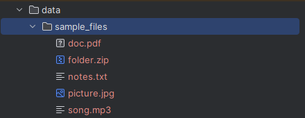
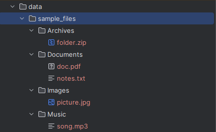

# File Sorter (Python)

A simple Python script that organizes files in a folder into subfolders by type (documents, images, videos, etc.).

## Why I built it
Practicing Python scripts and for practical use in my own folders with messy files.

## How to run
1. Clone the repo:
   ```bash
   git clone https://github.com/deastok/py-file-sorter.git
   cd py-file-sorter

## Demo
**Before sorting:**


**After sorting:**
